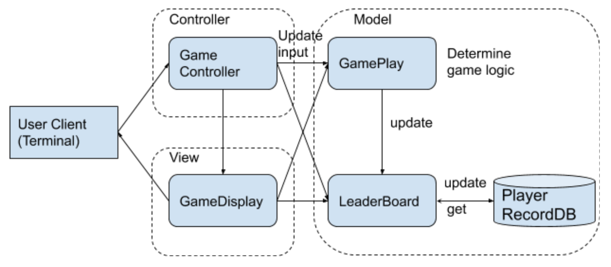

# reach-project

## Requirements

The word guessing game is built in JAVA that can be played against computers in terminal. 

Basic Features
   * The length of the secret word is displayed to the guesser as a set of question marks.
   * As the guesser makes correct guesses, occurrences of the guessed letter in the word are shown while unknown letters are still hidden.
   * The number of guesses remaining is displayed.
   * A list of incorrect guesses are displayed.

Extended Features
   * Game leaderboard to show rankings of players who had played the game.
   * Difficulty level support to let player to choose before each game.
   * The hangman diagram will be shown during the game play.
   * A life saver to help people win the game -- winning score will be cut if life saver is used.
   * Whole word guess is supported.

## Proposed Solution

I adopted the model-view-controller architecture pattern to design the word guessing game. The interactions between model view controller is illustrated in the following figure:

The class structure is as follows:

| Package              | Class           | Description                                                     |
| -------------------- | ----------------|-----------------------------------------------------------------|
| Controller           | GameController  | Controller to init, play and exit game.                         |
| Model                | GamePlay        | Logic for word guessing game.                                   |
| Model                | GuessWord       | Data structure to represent guess word.                         |
| Model                | LeaderBoard     | Interact with DB to load player history and update player score.|
| Model                | WordDict        | Define word dictionary and implement word pick.                 |
| View                 | GameDisplay     | Render views in different scenarios.                            |
| Common               | DBUtil          | Database Utils.                                                 |
| Entities             | Player          | Data Structure to represent a player.                           |
| Entities             | Score           | Define score constants.                                         |
| Entities             | GameStatus      | Define game status enum.                                        |
Testing classes of important logic are implemented.

## Tools, Technology and Frameworks

| Category             | Description                                                                      |
| -------------------- | -------------------------------------------------------------------------------- |
| Build Tool           | Maven: Configuration + Dependency                                                |
| IDE                  | Used Intellij for code development, debugging and deployment.                    |
| Database and Access  | Used SQLite3 to create local database and JDBC framework to connect to the DB    |
| Unit test            | TestNG                                                                           |

## How to Build and Run the Program
   
   * Download the project from github
   * Build the project using maven -- please install maven if you do not have it
   * mvn package
   * java -cp target/wordguessing-1.0-SNAPSHOT.jar com.xinchen.wordguessing.main.Main
   * Follow the instructions to play the game, have fun!
